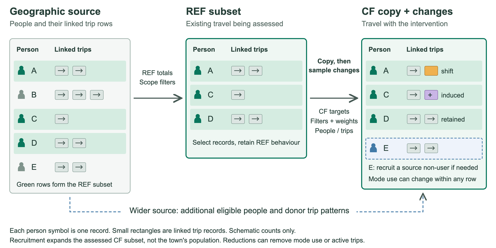

## Source population, REF and CF

{width=9in}

::: {.notes}
Read left to right. The geographic source supplies synthetic people and linked trip records. Green source rows illustrate the REF subset selected to represent the assessed existing travel. REF can also need modeled donor trip patterns to meet a fixed trip target, so the picture is a simplified starting case.

CF begins as a copy of REF. CF targets define the requested change. Scope filters define eligibility. Sampling weights favour particular age, sex, physical-activity and trip-distance patterns; diversion assumptions guide source modes. These criteria govern which records change.

In the CF illustration, A has a trip switched to an active mode. C has an induced trip added. D remains unchanged. E illustrates recruitment of an existing source non-user from outside REF, when needed to meet a higher user target. E brings existing linked trips, and the model changes their mode use. E is not a new town resident or a duplicated person.

The lower arrow shows the fallback to the retained source pool for eligible people or donor trip patterns. Trip patterns can be sampled with replacement when required by fixed trip and person targets. An already shifted trip cannot shift again. Lower CF targets can instead reduce mode use or active trips. Illustrative row counts do not imply population proportions.
:::
