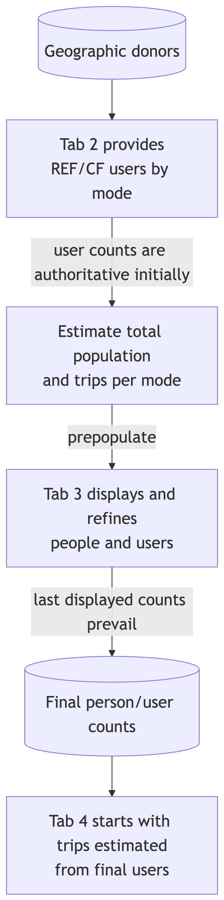
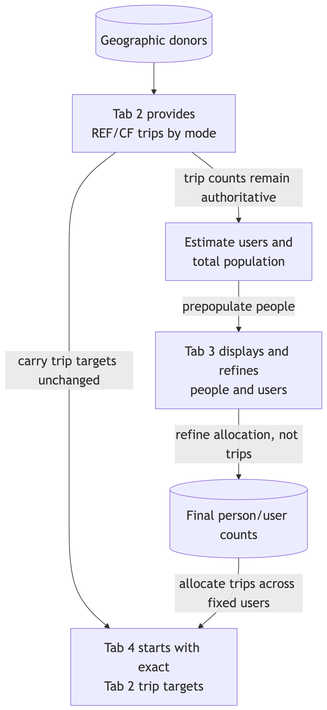
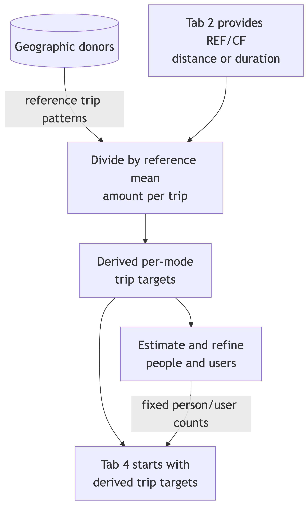
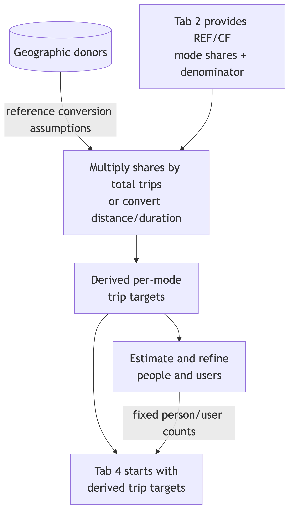
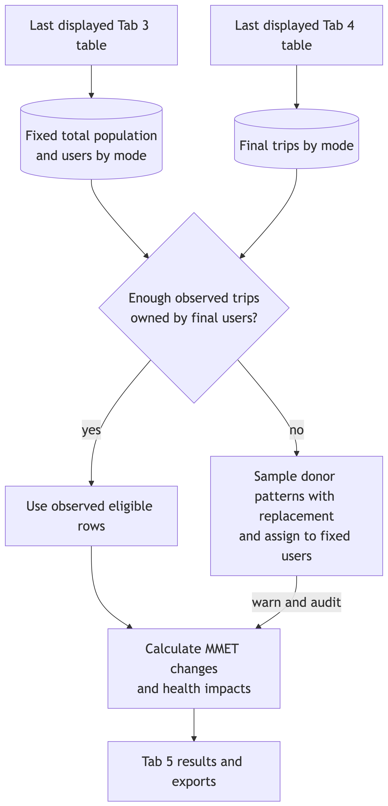
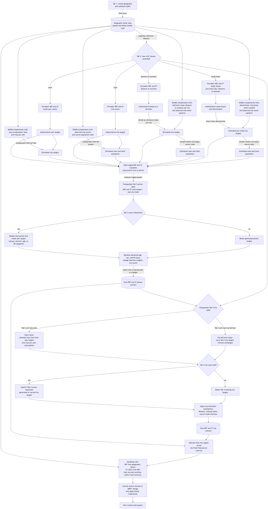

## Tab 1: the source population

**An appraisal starts with a place.**

- Select a Local Authority District (LAD), such as Leeds.
- The app draws on a synthetic population: people with linked travel and physical-activity information.
- Local patterns provide starting values for your appraisal.
- Your assessed population can be smaller than the whole district.

::: {.notes}
MIAMA estimates the health implications of a change in active travel. The source population supplies both reference information and examples of existing travel behaviour for sampling.

Synthetic people represent population patterns. They are not identified residents or a list of actual scheme participants. People and trips are linked, so the app can estimate who receives additional physical activity.

The geographic source and the population assessed by a particular scheme are distinct. For a demonstration using the Leeds sample profile, explain that it contains 5,000 synthetic people and is a testing dataset, not the full Leeds population. Availability depends on the deployed data profile.

Sources: docs/current/documentation/methodology.qmd, Reference synthetic population; README.md, Tab 1 and runtime data profiles.
:::

## Tab 2: active-travel volume

**Describe travel in the reference and intervention scenarios.**

1. **Users:** number of people using each mode.
2. **Trips:** number of trips, with a timeframe.
3. **Distance or duration:** travel distance or time.
4. **Mode shares:** percentages, with a total travel amount.

Initial values come from the source population. Edit these to describe your scheme.

::: {.notes}
Reference means the situation used for comparison. Counterfactual means the situation expected with the intervention. These are two scenarios, not necessarily two different dates.

Choose one of the four input routes. Distance and duration are alternatives within one route. Check whether inputs are totals or per person and check the timeframe. Mode shares require a denominator: a percentage alone does not describe the size of a scheme.

For example, enter 15,000 reference walking trips and 20,000 intervention walking trips per week. Those are illustrative inputs, not a prediction or observed result. The app estimates the people associated with that travel. With user inputs, it estimates corresponding trips instead.

Basic mode uses assumptions to complete the assessment without requiring the advanced refinement steps. Selected modes may include walking, cycling, e-biking and walking associated with public transport.

The initial values are suggestions, not estimates of your intervention. REF describes the existing active travel you want to assess. CF describes the expected total with the intervention, not just the increase. In the example, enter 20,000 as CF, not 5,000. Source patterns and assumptions fill in information you have not supplied, such as trips per user.

In the basic workflow, people who supply trips, distance/duration or mode shares can optionally specify the assessed population as additional information. Otherwise the app uses its population estimate. Basic users can then proceed to results without reviewing Tabs 3 and 4.

Sources: R/tab2_input_conversion.R; docs/current/documentation/methodology.qmd, Basic specification and Continuity from Tab 2 to Tabs 3 and 4.
:::

## Tab 3: the assessed population

**First set the scope, then refine the distribution.**

- **Scope:** adjust REF and CF counts and eligible population categories.
- **Distribution:** refine age, sex and physical-activity patterns.
- Scope supplies count targets and filter criteria.
- Sampling weights favour particular people within the eligible pool.

Starting values come from Tab 2.

::: {.notes}
Basic population refinements change the assessed scope. Advanced distributions influence which people or trip patterns are more likely to be sampled. The distinction matters because the same number of additional trips can have different health effects depending on who receives the activity.

Explain these as two separate operations. Scope answers 'how many people, and which categories are eligible?' Distribution answers 'among those eligible, who is more likely to be selected?' Excluding an age or physical-activity category is a filter. Changing a preferred age, sex balance or activity distribution changes sampling weights. A weight is a relative selection preference, not a guarantee of an exact realized category count.

Tab 2 provides the starting values. If you supplied trips, population refinements should preserve those trip totals until you explicitly change them in Tab 4. If you supplied users, Tab 3 establishes the user numbers and Tab 4 refines trips within that population. Tab 4 should not infer a different population merely because trip counts change.

New users means people starting to use an active mode. Newly induced trips means additional trips that did not exist in the reference scenario. A current user can make a newly induced trip. A new user can switch an existing trip from another mode.

The model samples from eligible source people and trip patterns. A person may use several modes, but an already shifted trip cannot be shifted again to another mode. Defaults and eligibility rules can constrain what is feasible.

REF determines the starting scope and current mode users. CF specifies the desired situation after the change. For an explicit user-count example, REF = 100 cyclists and CF = 120 cyclists means retaining the current cyclists and recruiting 20 eligible source non-cyclists. The model can draw these from outside the assessed REF subset but within the retained geographic source. CF = 80 instead means selecting 20 current cyclists to stop that mode use, not deleting 20 residents.

When the input is trips rather than people, a rise in trips does not imply the same proportional rise in users. Existing users can make more trips. The current/new-user assumption helps allocate the additional travel when user counts have not been supplied explicitly. Explicit user counts take precedence over that assumption. Advanced age, sex and activity distributions influence sampling probabilities.

Sources: R/api_refinement_profile_defaults.R; R/counterfactual_data_apply_ui_values.R; docs/current/documentation/methodology.qmd, Continuity and Counterfactual sampling and redistribution.
:::

## Tab 4: trips and physical activity

**First set trip scope, then refine trip patterns.**

- **Scope:** adjust REF and CF trip totals. Keep population fixed.
- **Distribution:** refine distances and source modes for shifts.
- Scope supplies counts and filters. Distributions guide weights.
- Separately, specify the share of newly induced trips.

Changed travel time changes physical activity.

::: {.notes}
Travel becomes physical-activity exposure through active time and the intensity of the activity. The calculation accounts for existing physical activity, rather than treating every added minute as having the same health benefit for everyone.

Use the same scope-versus-distribution distinction as on Tab 3. Trip totals define how much travel is assessed. Eligibility rules determine which source trips can contribute; distance distributions and diversion assumptions guide selection among candidates. Source-mode diversion preferences may be implemented through mode-specific allocation as well as weights. Do not imply that every Tab 4 distribution is a hard exclusion rule or an exact quota. In particular, the legacy basic distance slider is not a fully operational trip-scope filter in HUB; the operational distance-distribution controls guide sampling instead.

For REF = 15,000 and CF = 20,000 walking trips per week, the requested net increase is 5,000. The model starts with REF and samples changes toward the CF target. Source-mode assumptions guide which existing trips switch. The induced-trip assumption determines the share added as new journeys. Current/new users and shifted/induced trips are distinct splits. One person may use multiple active modes, but a shifted trip is unavailable for a second shift.

People's available trip patterns, sampling constraints and any explicit population targets govern allocation. Where the accepted user pool owns too few observed trips, donor-pattern sampling with replacement can support the trip target. That reuses a travel pattern; it does not permit the same existing trip to switch twice.

Trip inputs in Tab 2 remain authoritative until an explicit Tab 4 edit supersedes them. Tab 4 refinements should preserve the accepted Tab 3 person counts. The resulting trips per person can therefore change. Review both tables when testing this handoff.

HUB uses precomputed MIAMA-HM health trajectories and exposure-response lookup information. It does not rerun the entire health microsimulation for each click. The lookup varies by health-model strata and cycle. HALYs combine survival with adjustments for ill health.

The assessment period is configurable. Use the period shown in the app rather than promising a fixed number of years here. This is a model of expected health effects under the scenario assumptions, not a forecast of individual outcomes. These slides describe the physical-activity health pathway; they do not claim to include every transport benefit or harm.

Sources: R/counterfactual_data_apply_health_outcomes.R; docs/current/documentation/methodology.qmd, From physical activity to health trajectories and Health-adjusted life years.
:::



## Sampling: priorities and fallbacks

**CF starts from REF. The requested difference drives sampling.**

- **Priority:** explicit counts prevail. Tab 4 preserves Tab 3 people.
- **People:** eligible REF non-users first, then the wider source.
- **Trips:** shifts plus induced trips. Each trip can shift once.
- **Fallbacks:** relax weights, reuse trip patterns, or add induced trips when shifts fall short.

Filters remain binding. Too few eligible people requires a revised request.

::: {.notes}
REF inputs establish the starting scope. CF inputs specify a target situation, so the difference determines whether the model samples additions or reductions. CF initially copies REF. This is why two CF totals of 120 users represent different interventions when REF is 100 versus 50.

INPUT PRIORITY. Explicit user-count inputs take precedence over a default current/new-user percentage. For a trip-based Tab 2 route, the trip target remains binding through Tab 3 unless explicitly changed in Tab 4. Tab 3 determines the accepted person counts. Tab 4 may change trips per person but should not infer a new population. Later explicit Tab 4 trip counts supersede earlier estimated trip counts or trip targets derived from mode share or distance/duration. Otherwise the upstream input remains authoritative.

PEOPLE. To increase mode users, first select eligible baseline non-users already inside the assessed population. Recruit a shortfall from eligible non-users elsewhere in the retained geographic source. A person can use several modes. People are not duplicated to satisfy a user-count target. If too few eligible people exist in the full source, a revised target or category selection is needed. Fewer CF users means selecting current users to reduce or stop the mode, while retaining the people for health accounting.

TRIPS. To increase active trips, switch eligible existing trips according to the source-mode assumptions and add the induced share. Keep already-shifted trips unavailable for a second shift. If the fixed user pool owns too few observed trip patterns to meet a fixed trip target, sample geographic donor patterns with replacement and assign them to the fixed people. This creates modeled trip records, not duplicate people. A shortfall of switchable CF trips can become induced trips, changing the realized shifted/induced split. Reports retain these mechanism counts. Fewer active trips means switching eligible active trips away.

WEIGHTS AND FILTERS. When there are insufficient positive-weight candidates, the implementation can fill the unavoidable remainder uniformly from other eligible candidates. It does not thereby reintroduce an excluded category. Category selections can also trigger a warning and adjustment of stale submitted scope totals to eligible capacity. These are distinct from unconstrained replication or ignoring a filter.

ZERO REFERENCE. Zero REF activity with positive CF activity still needs people. HUB derives a person boundary from CF volume, with the geographic person pool as a fallback if a source rate is unavailable. Zero REF mode trips/users do not mean an empty geographic donor population.

Sources: README.md, Feasibility rules and sampling sources and What happens when a requested sample cannot be drawn; R/reference_data_apply_appraisal_scope.R; R/counterfactual_data_sampling_functions.R; R/counterfactual_data_apply_ui_values.R.
:::

## Tab 5: health impacts

**Activity changes affect modelled health outcomes.**

- Calculate the outcome difference: **CF minus REF**.
- Lower disease and mortality outcomes indicate a benefit.
- Report prevented deaths and disease cases, life-years gained and health-adjusted life-years (HALYs).
- Inspect plots and exports over the assessment period.

Results depend on the input estimates, source data and modelling assumptions.

::: {.notes}
Begin testing with a plausible scenario, then vary one input while keeping the others fixed. Check whether the population and trip tables remain understandable as you move through the app. Check that reference and intervention trip results reflect the intended scenario and any explicit refinements.

HALYs means health-adjusted life-years: a measure combining length of life with health during those years. Distinguish life-years gained from deaths prevented; they answer different questions. Disease-case totals are counts of outcomes and do not necessarily count distinct people.

The technical outcome difference is CF minus REF. For adverse outcomes, such as disease cases and deaths, a reduction is therefore negative. The app reverses the sign for 'prevented' results: REF minus CF, so benefits display as positive. For life-years and HALYs, gains use CF minus REF. Avoid describing all headline results as raw risk differences: they summarize expected events or years of life over the assessment period, with the configured population scaling.

For feedback, record the data profile and geography, selected modes, input route, reference and counterfactual inputs, refinements, and the unexpected output. Include a screenshot or export where useful. Please flag apparently implausible outputs even when the app does not show an error.

Sampling can introduce variation. Small effects and rounded headline values need careful interpretation. Outputs are conditional model estimates and do not themselves quantify all sources of uncertainty.

Sources: R/results_data_prepare.R; README.md, Tab 5: Present and export results; docs/current/documentation/methodology.qmd, Validation, uncertainty, and remaining work.
:::

## Backup: user-count inputs

{height=4.5in}

::: {.notes}
User counts are the provided quantity. Source patterns supply initial trip estimates. Tab 3 establishes the final person targets, and Tab 4 can adjust the trips assigned to those people.

Full-resolution diagram: [User-count route](ui_data_authority_workflow_png/01-user-count-route.png). Open the original PNG and zoom for detailed discussion. Source: docs/archive/2026-09-11/ui_data_authority_workflow_diagrams.qmd.
:::

## Backup: trip-count inputs

{height=4.5in}

::: {.notes}
Trip counts are the provided quantity. The app estimates the people needed to represent that travel. Population refinements preserve the trip targets until an explicit Tab 4 edit. Changed user counts therefore change trips per user.

Full-resolution diagram: [Trip-count route](ui_data_authority_workflow_png/02-trip-count-route.png). Source: docs/archive/2026-09-11/ui_data_authority_workflow_diagrams.qmd.
:::

## Backup: distance or duration inputs

{height=4.5in}

::: {.notes}
The app converts supplied distance or duration into estimated trip counts using source means per trip, then derives person equivalents. Realized totals reflect sampled trip patterns; these are not guaranteed to reproduce an exact aggregate distance or duration. A later explicit Tab 4 trip count supersedes the derived trip count.

Full-resolution diagram: [Distance/duration route](ui_data_authority_workflow_png/03-distance-duration-route.png). Source: docs/archive/2026-09-11/ui_data_authority_workflow_diagrams.qmd.
:::

## Backup: mode-share inputs

{height=4.5in}

::: {.notes}
The app combines mode shares with the supplied or suggested denominator to derive per-mode trip targets. Shares alone do not define population size. Later explicit trip edits can change the realized shares.

Full-resolution diagram: [Mode-share route](ui_data_authority_workflow_png/04-mode-share-route.png). Source: docs/archive/2026-09-11/ui_data_authority_workflow_diagrams.qmd.
:::

## Backup: population-to-results handoff

{height=4.5in}

::: {.notes}
Trace how accepted population counts pass to trip allocation and final results. The aim is a forward sequence: later trip refinements do not recalculate the accepted person counts. Filters and sampling weights refine allocation within this sequence.

Full-resolution diagram: [Tab 3 to results](ui_data_authority_workflow_png/05-tab3-to-results-handoff.png). Source: docs/archive/2026-09-11/ui_data_authority_workflow_diagrams.qmd.
:::

## Backup: complete workflow

{height=4.5in}

::: {.notes}
Use this as an orientation map, not a diagram to read box by box when projected. The preceding route-specific backups are easier to discuss. The complete workflow connects source data, all four Tab 2 routes, population and trip refinements, sampling, and health results.

Full-resolution diagram: [Complete workflow](ui_data_authority_workflow_png/06-comprehensive-workflow.png). Source: docs/archive/2026-09-11/ui_data_authority_workflow_diagrams.qmd. The diagrams describe the intended data-authority workflow; use the sampling slide and its notes for current fallback details and implementation nuances.
:::
